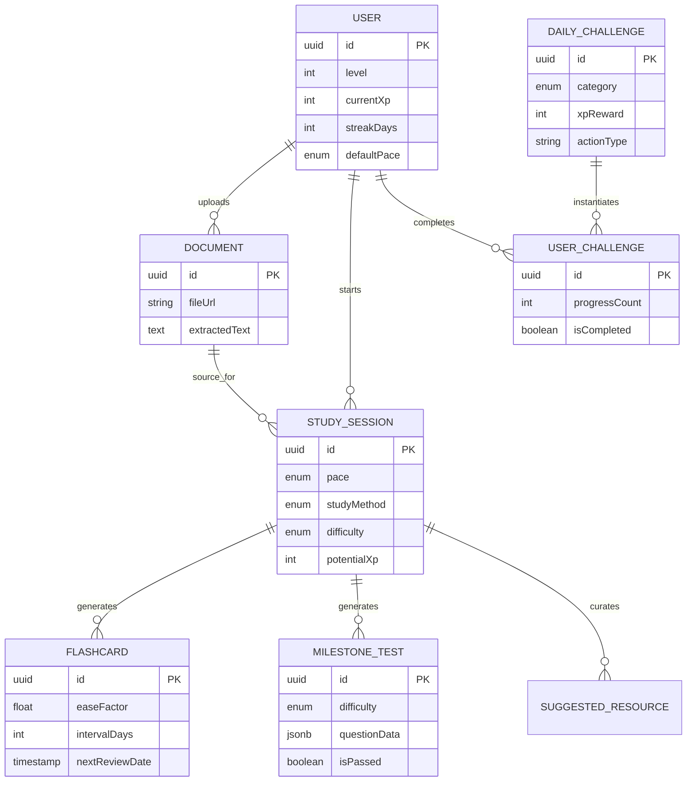

# IntellectXP: Project Architecture and Progression System

This document defines the database architecture for IntellectXP. The system connects user accounts, uploaded learning documents, generated study sessions, study tools, and daily progression challenges.

## Contents

- [IntellectXP: Project Architecture and Progression System](#intellectxp-project-architecture-and-progression-system)
  - [Contents](#contents)
  - [Architecture Overview](#architecture-overview)
  - [Product Requirements](#product-requirements)
    - [Users and Accounts](#users-and-accounts)
    - [Documents and AI Processing](#documents-and-ai-processing)
    - [Study Sessions and AI Chats](#study-sessions-and-ai-chats)
    - [Study Tools](#study-tools)
    - [Daily Activities](#daily-activities)
    - [Administration and Permissions](#administration-and-permissions)
  - [Key Decisions](#key-decisions)
  - [Implementation TODOs](#implementation-todos)
    - [Phase 1: Account and Access Foundation](#phase-1-account-and-access-foundation)
    - [Phase 2: Document Processing](#phase-2-document-processing)
    - [Phase 3: Study Sessions and Tools](#phase-3-study-sessions-and-tools)
    - [Phase 4: Tests, Questions, and XP](#phase-4-tests-questions-and-xp)
    - [Phase 5: Security and Later Features](#phase-5-security-and-later-features)
    - [Initial Attribute Baseline](#initial-attribute-baseline)
  - [Entity Relationships](#entity-relationships)
  - [Prisma Schema](#prisma-schema)

## Architecture Overview

| Area | Responsibility |
| --- | --- |
| Users | Track identity, level, XP, streaks, and default study preferences. |
| Documents | Store uploaded source material and extracted text. |
| Study sessions | Represent a planned or completed learning session based on a document. |
| Study tools | Provide flashcards, milestone tests, and suggested resources generated for a session. |
| Daily challenges | Track recurring progression goals and each user's progress toward them. |

## Product Requirements

### Users and Accounts

- Support email and passwordless or password-based login as appropriate for the chosen authentication provider.
- Support Google, Facebook, and Instagram connections where the provider supports the required authentication flow. Social connections must be linked to one user account rather than creating duplicate accounts.
- Store the user's connected identity providers so they can log in with Google or Facebook after the initial account is created.
- Store the current subscription plan, such as `LITE` or `PRO`.
- Store the user's creation timestamp for the "Member since" display.
- Support invitation links for sharing progress. Define the invitation scope, expiration, revocation, and whether the link grants view-only access during the attribute-design pass.
- Plan two-factor authentication for a later phase. It is not part of the initial authentication release.

### Documents and AI Processing

- Accept PDF, PowerPoint, Word, and plain-text files.
- Preserve the original uploaded file and its metadata.
- Extract text, structure, tables, and visual information where possible. Use OCR for scanned documents and image-based pages.
- Store the AI-refined representation separately from the original extraction so the source can be reprocessed when the pipeline improves.
- Track processing status, parser version, errors, and timestamps. Processing should be asynchronous so large files do not block the upload request.
- Keep document ownership and access controls independent from generated study content.

Recommended ingestion pipeline:

1. Store the original file in object storage and create a document-processing job.
2. Detect the file type and route it to a parser that supports layout and visual extraction, not only plain text.
3. Normalize the result into structured content such as pages, headings, paragraphs, tables, images, and captions.
4. Run an AI refinement step that cleans, classifies, and summarizes the extracted content without replacing the source data.
5. Optionally create embeddings for semantic search and retrieval inside study sessions.
6. Record the pipeline version and allow failed documents to be retried.

The initial product does not need a user-authored prompt for every upload. Use system-defined processing instructions and study-session templates first. Add optional user prompts later if users need to control focus, exclusions, or learning goals.

### Study Sessions and AI Chats

- Treat a study session as the persistent record of an AI chat about one or more uploaded documents.
- Store the session messages, referenced documents, generated outputs, and completion state.
- At session creation, let the user choose an explanation pace: brief, normal, or complex.
- At session creation, let the user choose a study method, including spaced repetition, the Pomodoro Technique, and the Feynman Technique.
- Support milestone tests at the end of a module or session. Passing tests awards XP.
- Use the same question engine for milestone tests and daily challenges where the behavior is shared.

### Study Tools

Study tools should remain features generated within a study session rather than a separate top-level domain at this stage. Flashcards, summaries, practice questions, and recommended resources belong to the session that generated them, while their own progress and review state remain persistent.

Revisit this boundary if tools later need to be reused across sessions or accessed from a global review queue.

### Daily Activities

Daily activities have two distinct types:

| Type | Purpose | Examples |
| --- | --- | --- |
| Daily quest | Track a measurable action or progress target. | Upload two documents, complete three session segments. |
| Daily challenge | Deliver an assessment made up of several question types. | Match, describe, true or false, single choice, and multiple choice. |

Milestone tests may use the same question types as daily challenges. Store question type and answer data in a shared, versioned question format so tests can be generated and graded consistently.

### Administration and Permissions

- Support an admin role for support staff.
- Admins can perform full CRUD operations on users, documents, sessions, challenges, and generated study content, subject to audit logging and authorization checks.
- Regular users can perform full CRUD operations on their own study sessions and generated session tools.
- Regular users must not access another user's private documents, chats, or study content unless an explicit invitation or sharing permission allows it.

## Key Decisions

| Topic | Initial decision | Revisit when |
| --- | --- | --- |
| Authentication | Use an authentication provider that supports email login and social account linking. Keep provider identities separate from the user profile. | Provider selection and deployment planning. |
| Two-factor authentication | Defer to a later phase. | Before production accounts contain sensitive personal data. |
| Document understanding | Use asynchronous extraction, OCR/layout analysis, AI refinement, and optional embeddings. Preserve every source stage. | After testing representative PDF, PPT, DOCX, and TXT samples. |
| User prompting | Do not require a prompt for upload or normal study-session creation. Start with system templates and add optional prompts later. | After observing requests for custom learning goals or document focus. |
| Study tools | Keep tools owned by study sessions for now. | When cross-session review and reuse become core workflows. |
| Question types | Share a question model between milestone tests and daily challenges. | During the question schema and grading design. |
| Invitations | Start with expiring, revocable links and explicit permission scope. | When collaboration requirements are defined. |

## Implementation TODOs

The following decisions turn the open items above into an implementation order. The Prisma schema should be updated after this checklist is approved.

### Phase 1: Account and Access Foundation

- [ ] Use Auth.js with the Prisma adapter for email login and social account linking, unless deployment requirements rule it out.
- [ ] Add an `Account` model for provider, provider account ID, access tokens, and provider-specific metadata. Keep provider identities separate from `User`.
- [ ] Add `User.createdAt`, `User.updatedAt`, `User.plan`, and `User.role`.
- [ ] Use `FREE`, `LITE`, and `PRO` as the initial plan values. Define feature limits and billing behavior before enabling paid plans.
- [ ] Use `USER` and `ADMIN` as the initial roles. Protect admin CRUD routes with server-side authorization and record admin mutations in an audit log.
- [ ] Confirm the Instagram requirement before implementation. Instagram is not a general-purpose login provider in the same way as Google or Facebook; support it only if the selected Meta flow and target account type meet the product need.
- [ ] Define invitation links as expiring, revocable, single-purpose links with `VIEW_PROGRESS` scope by default. Never place the raw secret in the database; store a hash instead.
- [ ] Add rate limits, email verification, account recovery, and session revocation before production launch.

### Phase 2: Document Processing

- [ ] Create a document-processing job with `QUEUED`, `PROCESSING`, `COMPLETED`, and `FAILED` states.
- [ ] Store the original file in object storage and keep only its storage key, MIME type, size, checksum, and upload metadata in PostgreSQL.
- [ ] Evaluate a layout-aware parser and OCR pipeline against representative PDF, PPTX, DOCX, and TXT fixtures. Compare extraction quality for headings, tables, images, captions, and scanned pages.
- [ ] Store immutable processing artifacts separately: raw extraction, normalized document blocks, AI-refined content, and optional embeddings.
- [ ] Attach `parserVersion`, `refinementVersion`, `processedAt`, and `errorMessage` to each processing run so results can be reproduced and retried.
- [ ] Start with system-defined refinement instructions. Do not require a prompt from the user during upload.
- [ ] Add optional user focus instructions only after measuring whether fixed templates fail to produce useful sessions.
- [ ] Enforce file size, page count, MIME type, malware scanning, retention, and deletion policies before accepting production uploads.

### Phase 3: Study Sessions and Tools

- **Status:** Frontend workspace implemented at `/sessions/new`; persistence, AI responses, and database ownership are pending the backend foundation.

- [ ] Allow a study session to reference multiple documents through a join model instead of requiring exactly one `documentId`.
- [ ] Add persistent chat messages with role, content, token usage, model, creation time, and optional document citations.
- [ ] Rename the current pace concept to an explanation level if that better matches the UI: `BRIEF`, `NORMAL`, and `COMPLEX`.
- [ ] Expand study methods to include `SPACED_REPETITION`, `POMODORO`, and `FEYNMAN`, while keeping the enum extensible.
- [ ] Keep flashcards, summaries, practice questions, and resources owned by their generating study session for the first release.
- [ ] Add a global review query for due flashcards without moving flashcards into a separate top-level ownership model.
- [ ] Revisit cross-session tool reuse only after a global review workflow is validated.

### Phase 4: Tests, Questions, and XP

- **Status:** Shared frontend assessment engine implemented at `/assessments`; database persistence, server-side grading, and durable XP events are pending the backend foundation.

- [ ] Create a shared question model with `type`, `prompt`, `options`, `correctAnswer`, `explanation`, `points`, and `version`.
- [ ] Support `MATCH`, `DESCRIBE`, `TRUE_FALSE`, `SINGLE_CHOICE`, and `MULTIPLE_CHOICE` question types.
- [ ] Store answers and grading results separately from the question definition so attempts can be audited and rescored.
- [ ] Use the shared question model for both milestone tests and daily challenges.
- [ ] Define XP rules for question difficulty, completion, passing, retries, and duplicate reward prevention.
- [ ] Split daily activity records into `DAILY_QUEST` and `DAILY_CHALLENGE` categories, with separate progress and completion behavior.
- [ ] Add idempotency checks so refreshing a completion endpoint cannot award XP twice.

### Phase 5: Security and Later Features

- [ ] Add two-factor authentication after the initial account flow is stable. Prefer an authenticator-app TOTP flow, with recovery codes and an account lockout policy.
- [ ] Add audit events for admin access, document deletion, account linking, invitation creation, and XP adjustments.
- [ ] Add retention and deletion workflows for original files, extracted data, AI outputs, chat history, and embeddings.
- [ ] Review privacy, consent, provider terms, and data-export requirements before production launch.

### Initial Attribute Baseline

These are the minimum attributes to define in the next schema pass.

| Area | Initial attributes |
| --- | --- |
| User | `id`, `email`, `displayName`, `avatarUrl`, `role`, `plan`, `level`, `currentXp`, `streakDays`, `lastLoginAt`, `createdAt`, `updatedAt` |
| Account | `userId`, `provider`, `providerAccountId`, provider token metadata, `createdAt`, `updatedAt` |
| Invitation | `creatorId`, token hash, `scope`, `expiresAt`, `revokedAt`, `acceptedAt`, `createdAt` |
| Document | `userId`, `title`, storage key, MIME type, size, checksum, processing status, parser version, refinement version, error, `createdAt`, `updatedAt` |
| Document artifact | `documentId`, artifact type, structured content, version, `createdAt` |
| Study session | `userId`, title, explanation level, study method, status, `potentialXp`, `earnedXp`, `startedAt`, `completedAt`, `createdAt`, `updatedAt` |
| Chat message | `sessionId`, role, content, model, token usage, citations, `createdAt` |
| Question | owner test/activity, type, prompt, options, answer data, explanation, points, version |
| Question attempt | `userId`, question ID, submitted answer, score, correctness, `createdAt` |
| XP event | `userId`, source type, source ID, amount, idempotency key, `createdAt` |

## Entity Relationships

The following diagram maps the core data flow from user creation and document processing through study sessions and gamified progression.



## Prisma Schema

The Prisma schema below is the implementation source for the architecture above.

```prisma
generator client {
        provider = "prisma-client-js"
    }

datasource db {
  provider = "postgresql"
  url      = env("DATABASE_URL")
}

// --- ENUMS ---
enum StudyPace {
  BRIEF
  NORMAL
  DETAILED
}

enum StudyMethod {
  FLASHCARDS
  QUIZ
  SUMMARY_ONLY
}

enum Difficulty {
  EASY
  MEDIUM
  HARD
}

enum ChallengeCategory {
  KNOWLEDGE_TEST
  SESSION_QUEST
}

// --- CORE TABLES ---
model User {
  id            String    @id @default(uuid()) @db.Uuid
  email         String    @unique
  displayName   String?
  
  level         Int       @default(1)
  currentXp     Int       @default(0)
  streakDays    Int       @default(0)
  lastLoginAt   DateTime  @default(now()) @db.Timestamptz(3)
  
  defaultPace   StudyPace @default(NORMAL)

  documents     Document[]
  sessions      StudySession[]
  challenges    UserChallenge[]
}

model DailyChallenge {
  id            String            @id @default(uuid()) @db.Uuid
  title         String
  description   String
  category      ChallengeCategory
  xpReward      Int
  targetCount   Int
  actionType    String
  dateActive    DateTime          @db.Date

  userChallenges UserChallenge[]
}

model UserChallenge {
  id            String    @id @default(uuid()) @db.Uuid
  userId        String    @db.Uuid
  challengeId   String    @db.Uuid
  progressCount Int       @default(0)
  isCompleted   Boolean   @default(false)
  completedAt   DateTime? @db.Timestamptz(3)

  user          User           @relation(fields: [userId], references: [id], onDelete: Cascade)
  challenge     DailyChallenge @relation(fields: [challengeId], references: [id], onDelete: Cascade)

  @@unique([userId, challengeId])
  @@index([userId])
  @@index([challengeId])
}

// --- STUDY CONTENT TABLES ---
model Document {
  id            String    @id @default(uuid()) @db.Uuid
  userId        String    @db.Uuid
  title         String
  fileUrl       String
  fileType      String
  extractedText String?
  createdAt     DateTime  @default(now()) @db.Timestamptz(3)

  user          User           @relation(fields: [userId], references: [id], onDelete: Cascade)
  sessions      StudySession[]

  @@index([userId])
}

model StudySession {
  id               String      @id @default(uuid()) @db.Uuid
  userId           String      @db.Uuid
  documentId       String      @db.Uuid
  title            String
  
  pace             StudyPace
  studyMethod      StudyMethod
  
  difficulty       Difficulty  @default(MEDIUM)
  estimatedMinutes Int         @default(30)
  potentialXp      Int
  isCompleted      Boolean     @default(false)
  createdAt        DateTime    @default(now()) @db.Timestamptz(3)

  user             User               @relation(fields: [userId], references: [id], onDelete: Cascade)
  document         Document           @relation(fields: [documentId], references: [id], onDelete: Cascade)
  
  flashcards       Flashcard[]
  milestones       MilestoneTest[]
  resources        SuggestedResource[]

  @@index([userId])
  @@index([documentId])
}

// --- STUDY TOOLS TABLES ---
model Flashcard {
  id             String       @id @default(uuid()) @db.Uuid
  sessionId      String       @db.Uuid
  front          String
  back           String
  
  easeFactor     Float        @default(2.5)
  intervalDays   Int          @default(0)
  nextReviewDate DateTime     @default(now()) @db.Timestamptz(3)

  session        StudySession @relation(fields: [sessionId], references: [id], onDelete: Cascade)

  @@index([sessionId])
  @@index([nextReviewDate])
}

model MilestoneTest {
  id             String       @id @default(uuid()) @db.Uuid
  sessionId      String       @db.Uuid
  title          String
  difficulty     Difficulty
  xpReward       Int
  isPassed       Boolean      @default(false)
  
  questionData   Json         

  session        StudySession @relation(fields: [sessionId], references: [id], onDelete: Cascade)

  @@index([sessionId])
}

model SuggestedResource {
  id             String       @id @default(uuid()) @db.Uuid
  sessionId      String       @db.Uuid
  title          String
  url            String
  type           String
  description    String?

  session        StudySession @relation(fields: [sessionId], references: [id], onDelete: Cascade)

  @@index([sessionId])
}
```